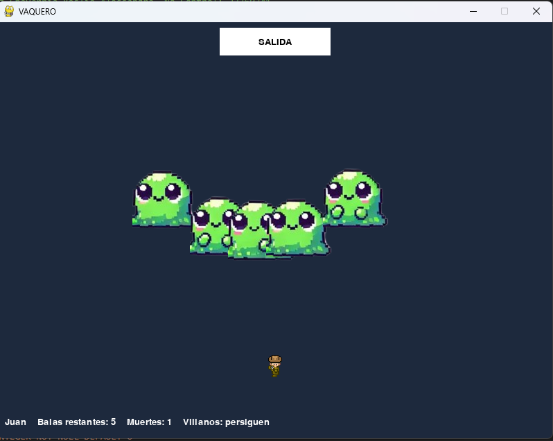

# VAQUERO EN LA CUEVA

## Descripción

**ProyGame: Vaquero en la Cueva** es un videojuego 2D desarrollado en Python utilizando Pygame y SQLite. El jugador controla a un vaquero que debe escapar de una cueva evitando a los villanos que lo persiguen y llegando a la salida.

## Detalles del Proyecto

- **Autor**: Sanchez Chavarria Yeslie Alessandra
- **Número de Control**: 23760341
- **Materia**: Graficación
- **Fecha de Creación**: 2025

## Características

**Gameplay**
- Personaje jugable: vaquero que debe escapar de la cueva
- 5 villanos enemigos que persiguen al jugador
- Sistema de vidas: el jugador muere tras 2 colisiones con villanos
- Objetivo: llegar a la salida (esquina superior)

**Controles**
- **WASD**: Movimiento del vaquero (arriba, abajo, izquierda, derecha)
- **Click Izquierdo**: Disparar balas hacia la posición del ratón
- **ESC**: Salir del juego (en pantalla de derrota)
- **ENTER**: Confirmar nombre del jugador

**Mecánicas de Juego**
- **Límite de balas**: Solo puedes disparar 5 balas en total por partida
- **Persecución retrasada**: Los villanos esperan 5 segundos antes de perseguir al jugador
- **Animación de sprites**: Personaje y villanos con animación fluida
- **Detección de colisiones**: Sistema de colisiones para disparos, enemigos y victoria

**Sistema de Base de Datos**
- Registro de jugadores con nombre único
- Tracking de muertes por jugador
- Tracking de victorias por jugador
- Base de datos SQLite: `juego.db`

## Requisitos

### Dependencias
- Python 3.7+
- Pygame
- SQLite3 (incluido en Python)

### Recursos
El juego requiere los siguientes archivos de imagen en el directorio raíz:
- `villanos.png`: Spritesheet con animaciones de villanos (3 filas de personajes, 5 frames por fila)
- `vaquero.png`: Spritesheet con animaciones del vaquero (4 filas de direcciones, 4 frames cada una)

## Instalación

1. **Clonar o descargar el proyecto**
```bash
cd ProyGame2025
```

2. **Instalar dependencias**
```bash
pip install pygame
```

3. **Asegurar que los archivos de sprite estén presentes**
- Coloca `villanos.png` y `vaquero.png` en el directorio raíz del proyecto

4. **Ejecutar el juego**
```bash
python main.py
```

## Estructura del Código

### Variables Principales
- `width, height`: Dimensiones de la pantalla (800x600)
- `bullets`: Lista de balas activas en el juego
- `villanos`: Lista de enemigos con su estado y posición
- `player_x, player_y`: Posición del jugador
- `deaths`: Contador de muertes del jugador actual

### Funciones Principales
- `reset_villanos_to_top()`: Coloca villanos vivos en la fila superior
- `reset_all_villanos()`: Resucita a todos los villanos (para reintentos)
- `draw_name_input()`: Dibuja la pantalla de entrada de nombre
- `draw_hud()`: Dibuja el HUD con información del juego
- `draw_game_over()`: Dibuja pantalla de derrota
- `draw_win_menu()`: Dibuja menú de victoria
- `reset_for_retry()`: Reinicia el estado para un nuevo intento

### Estados del Juego
- `entering_name`: Esperando entrada del nombre del jugador
- `pursuing`: Los villanos están persiguiendo al jugador
- `game_over`: El jugador ha perdido (2 muertes)
- `won`: El jugador ha ganado (llegó a la salida)

## Gameplay




### Objetivo
Llega a la salida (rectángulo blanco en la parte superior) sin morir más de una vez.

### Estrategia
1. Los villanos no perseguirán durante 5 segundos al iniciar
2. Tienes 5 balas para eliminar villanos (opcional, no es obligatorio)
3. Evita el contacto directo con los villanos
4. Si mueres una vez, se reinicia la posición pero continúas el juego
5. La segunda muerte significa game over

### Pantallas

**Entrada de Nombre**
- Muestra lista de jugadores guardados
- Permite introducir tu nombre para guardar el progreso

**Pantalla de Juego**
- HUD superior con información (nombre, balas restantes, muertes, estado villanos)
- Salida en la parte superior (objetivo)
- Vaquero y villanos con animaciones

**Pantalla de Victoria**
- Permite reintentar o salir

**Pantalla de Derrota**
- Presionar ESC para salir

## Base de Datos

### Tabla: jugadores
```sql
CREATE TABLE jugadores (
    id INTEGER PRIMARY KEY AUTOINCREMENT,
    nombre TEXT NOT NULL UNIQUE,
    muertes INTEGER NOT NULL,
    victorias INTEGER NOT NULL DEFAULT 0
)
```

### Uso
- Los datos se guardan al salir del juego
- Sistema UPSERT: suma muertes y victorias a jugadores existentes
- Permite ver el ranking de jugadores al iniciar

## Problemas y Soluciones

**El juego no inicia**
- Verifica que Pygame esté instalado: `pip install pygame`
- Asegúrate de estar en el directorio correcto

**Imágenes no cargan**
- Coloca `villanos.png` y `vaquero.png` en la carpeta raíz
- Verifica que los nombres de archivo sean exactos (incluyendo minúsculas/mayúsculas)

**Error de base de datos**
- La base de datos se crea automáticamente en la primera ejecución
- Si hay conflicto, elimina `juego.db` y vuelve a ejecutar

## Notas de Desarrollo

- El juego utiliza un sistema de frames para la animación
- Las colisiones se calculan usando rectángulos de colisión (AABB)
- La base de datos persiste entre sesiones
- El juego se ejecuta a 60 FPS

## Licencia

Proyecto académico para la materia de Graficación.

## Contacto

Para preguntas o sugerencias, contacta al autor del proyecto.
hw4400sc@gmail.com

